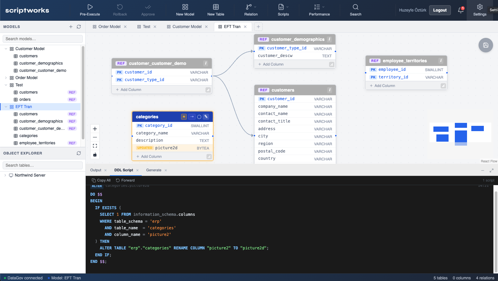
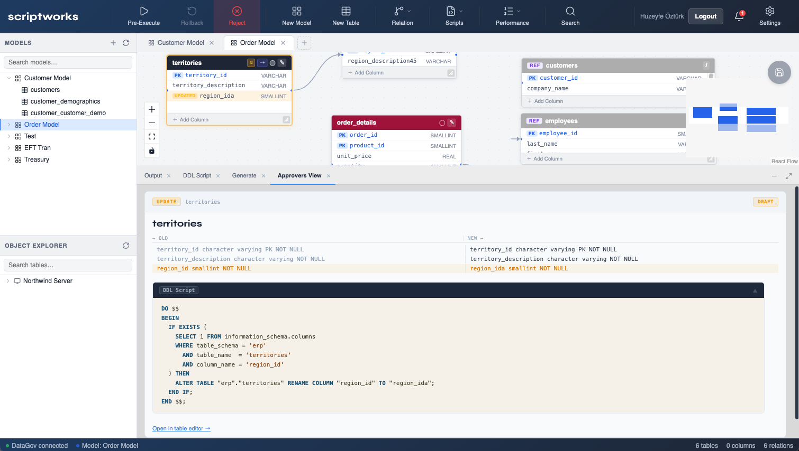
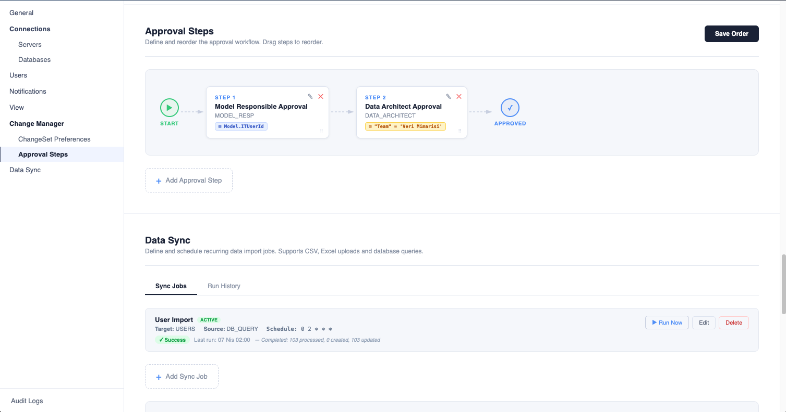

# Scriptworks

> A data modeling and change management platform.

Scriptworks is a full-stack data catalog and schema management platform built to digitalize enterprise data governance processes. It enables teams to visually design data models, route structural changes (DDL) through a multi-step approval workflow, and automatically execute approved changes on target databases.

---

## Screenshots





---

## Features

### Visual Data Modeling
- Interactive canvas powered by React Flow for designing tables and relationships
- Drag-and-drop node positioning with persistent layout
- Column editing, data type definition, and primary/foreign key management

### Change Set & Approval Workflow
- Every change is grouped under a **ChangeSet** with per-change **ChangeSetItem** tracking
- Multi-step approval process: **Data Architect → Admin**
- Per-item approve/reject mechanism with independent control at each step
- Role-based access control: `ADMIN`, `DATA_ARCHITECT`, `DEVELOPER` etc.
- Approval steps can be configurable per use case

### DDL Script Engine
- Dialect-aware DDL scripts are automatically generated for approved changes
- Safe DDL methods using `IF NOT EXISTS / IF EXISTS` guards
- Script preview with SQL syntax highlighting
- Sequential script execution with automatic rollback via

### Security & Connection Management
- Session-based authentication with Spring Security
- Database credentials stored with **AES** encryption
- Dynamic multi-target database connectivity over JDBC

### Catalog Management
- `DataSystem → DataStore → DataSchema → DataSet` hierarchy
- Visual catalog tree navigation via Object Explorer
- Catalog is automatically updated upon approval completion

---

## Architecture

```
┌─────────────────────────────────────────────────────────┐
│                     React Frontend                      │
│  Toolbar │ Canvas (React Flow) │ Terminal Panel         │
│  Object Explorer │ Table Editor │ Approval Panel        │
└────────────────────────┬────────────────────────────────┘
                         │ REST API (Axios)
┌────────────────────────▼────────────────────────────────┐
│                   Spring Boot Backend                   │
│                                                         │
│  ApprovalOrchestrationService                           │
│  ScriptExecutionService  (Saga + Rollback)              │
│  CatalogUpdateService                                   │
│  ChangeSetExecutionService                              │
│  DDL Generator  (dialect-aware)                         │
└────────────────────────┬────────────────────────────────┘
                         │
              ┌──────────▼──────────┐
              │     PostgreSQL      │
              │  Flyway Migrations  │
              └─────────────────────┘
```

---

## Tech Stack

| Layer | Technology |
|---|---|
| Frontend | React 18, Vite, React Flow, Zustand, Axios |
| Backend | Java 21, Spring Boot 3, Spring Security |
| Database | PostgreSQL |
| Migration | Flyway |
| DDL Engine | Custom JDBC (DriverManager) |
| Security | AES credential encryption, session-based auth |
| Pattern | Saga (distributed rollback orchestration) |

---

## Approval Flow

```
Developer → makes changes → ChangeSet is created
         → Submit For Approval

Model Owner → reviews CSIs → approves

Data Architect → reviews CSIs → approves
Admin          → reviews CSIs → approves

            ↓ (all steps completed)

Script Engine → executes DDL scripts sequentially
             → on failure: automatic rollback
             → on success: catalog is updated
```

---

## Project Structure

```
scriptworks/
├── backend/                    # Spring Boot application
│   └── src/main/java/
│       ├── config/             # Security, CORS, etc.
│       ├── controller/         # REST endpoints
│       ├── entity/             # JPA entities
│       ├── repository/         # Spring Data repositories
│       ├── script/             # Pure DDL computation classes
│       └── service/            # Orchestration services
│
├── ui/                         # React + Vite application
│   └── src/
│       ├── components/         # UI components
│       ├── store/              # Zustand state management
│       └── api/                # Axios request layer
│
└── images/                     # Uploaded assets
```

---

## Getting Started

### Prerequisites
- Java 21+
- Node.js 18+
- PostgreSQL 15+

### Backend

```bash
cd backend
# Update DB connection settings in application.properties
./mvnw spring-boot:run
```

Flyway migrations run automatically on startup.

### Frontend

```bash
cd ui
npm install
npm run dev
```

App runs at `http://localhost:5173`.

### Default Users

| Username | Role |
|---|---|
| `admin` | ADMIN |
| `architect` | DATA_ARCHITECT |
| `developer` | DEVELOPER |

---

## About

Built from the ground up to address a real enterprise need — managing database schema changes in a controlled, auditable, and reversible way across data governance teams.
